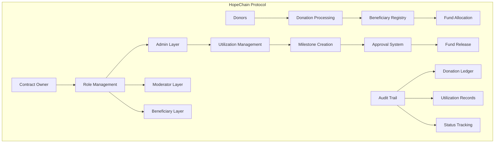

# HopeChain 🌟

### Decentralized Charity Management Protocol

[](https://stacks.co/)
[](https://clarity-lang.org/)

## 🎯 Overview

HopeChain revolutionizes charitable giving through blockchain technology, providing unprecedented transparency in donation tracking and fund utilization. Built on Stacks Layer 2, it enables donors to trace their contributions from donation to impact while empowering beneficiaries with milestone-based funding mechanisms.

## ✨ Key Features

- **🔍 Transparent Donation Tracking** - Complete audit trail for all contributions
- **📊 Milestone-Based Fund Release** - Accountability through staged funding
- **🔐 Multi-Tier Access Control** - Role-based permissions (Admin/Moderator/Beneficiary)
- **💰 Real-Time Balance Updates** - Live tracking of fund allocation
- **📈 Impact Metrics** - Comprehensive reporting on fund utilization
- **⚡ Stacks Layer 2 Optimized** - Low-cost, high-speed transactions

## 🏗️ System Architecture



## 🔧 Contract Architecture

### Core Components

#### 1. **Access Control System**

- **Contract Owner**: Supreme administrative authority
- **Admin Role**: Fund utilization management and milestone approval
- **Moderator Role**: Beneficiary registration and oversight
- **Beneficiary Role**: Fund recipient with limited permissions

#### 2. **Data Storage Layer**

```clarity
;; Primary Data Maps
- roles: { user: principal } → { role: uint }
- beneficiaries: { id: uint } → { beneficiary-details }
- donations: { id: uint } → { donation-record }
- utilization: { id: uint } → { milestone-data }
```

#### 3. **Business Logic Modules**

- **Registration Engine**: Beneficiary onboarding and validation
- **Donation Processor**: Secure fund transfer and tracking
- **Milestone Manager**: Fund utilization oversight
- **Audit System**: Immutable transaction recording

## 📊 Data Flow

### 1. Beneficiary Registration Flow

```
Moderator+ → Input Validation → Registry Creation → ID Assignment → Status: Active
```

### 2. Donation Processing Flow

```
Donor → Amount Validation → STX Transfer → Balance Update → Ledger Recording → Confirmation
```

### 3. Fund Utilization Flow

```
Admin → Milestone Creation → Amount Verification → Approval Process → Status Update → Fund Release
```

## 🚀 Quick Start

### Prerequisites

- Stacks Wallet (Hiro Wallet recommended)
- STX tokens for transactions
- Clarity development environment (optional for local testing)

### Deployment

```bash
# Clone the repository
git clone https://github.com/tobi-en/hope-chain.git
cd hope-chain

# Deploy to Stacks testnet
clarinet deploy --testnet

# Verify deployment
clarinet call-contract hopechain get-donation-count
```

### Basic Usage

#### 1. Register a Beneficiary (Moderator+)

```clarity
(contract-call? .hopechain register-beneficiary 
    u"Clean Water Initiative" 
    u"Providing clean water access to rural communities" 
    u1000000) ;; 1000 STX target
```

#### 2. Make a Donation

```clarity
(contract-call? .hopechain donate u1 u100000) ;; Donate 100 STX to beneficiary #1
```

#### 3. Create Utilization Milestone (Admin)

```clarity
(contract-call? .hopechain add-utilization 
    u1 
    u"Phase 1: Well drilling equipment purchase" 
    u250000) ;; 250 STX for milestone
```

## 📋 API Reference

### Public Functions

| Function | Access Level | Description |
|----------|--------------|-------------|
| `set-role` | Owner | Assign role to user |
| `remove-role` | Owner | Revoke user permissions |
| `register-beneficiary` | Moderator+ | Add new charity recipient |
| `donate` | Public | Contribute funds to beneficiary |
| `add-utilization` | Admin | Create fund usage milestone |
| `approve-utilization` | Admin | Approve milestone completion |

### Read-Only Functions

| Function | Description |
|----------|-------------|
| `get-beneficiary` | Retrieve beneficiary details |
| `get-donation-by-id` | Fetch specific donation record |
| `get-donation-count` | Get total donation count |
| `get-utilization-by-id` | Retrieve milestone information |
| `get-utilization-count` | Get total utilization records |

## 🔒 Security Features

- **Role-Based Access Control**: Hierarchical permission system
- **Input Validation**: Comprehensive parameter checking
- **Reentrancy Protection**: Safe external calls
- **Overflow Prevention**: Secure arithmetic operations
- **Self-Modification Guards**: Prevents privilege escalation

## 🧪 Testing

```bash
# Run test suite
clarinet test

# Check contract coverage
clarinet coverage

# Simulate transactions
clarinet console
```

## 📈 Roadmap

- **Phase 1**: Core contract deployment and basic functionality ✅
- **Phase 2**: Web interface and donor dashboard 🔄
- **Phase 3**: Mobile app integration 📱
- **Phase 4**: Cross-chain compatibility 🌐
- **Phase 5**: Advanced analytics and reporting 📊

## 🤝 Contributing

We welcome contributions! Please see our [Contributing Guide](CONTRIBUTING.md) for details.

1. Fork the repository
2. Create a feature branch (`git checkout -b feature/amazing-feature`)
3. Commit your changes (`git commit -m 'Add amazing feature'`)
4. Push to the branch (`git push origin feature/amazing-feature`)
5. Open a Pull Request

## 📄 License

This project is licensed under the MIT License - see the [LICENSE](LICENSE) file for details.

## 🙏 Acknowledgments

- Stacks Foundation for blockchain infrastructure
- Clarity language development team
- Open source community contributors
- Beta testers and early adopters
